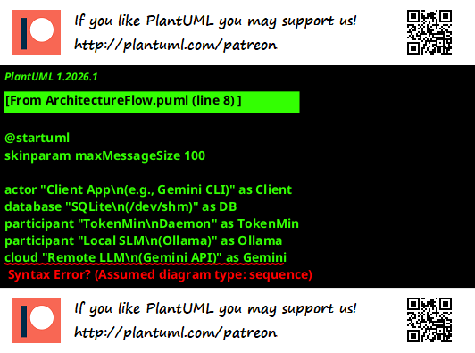

# 🪙 TokenMin

**TokenMin** is a Rust-based prompt pre-processor designed to reduce LLM API consumption by filtering and compressing chat context before it is sent to remote providers. It is designed for developers who want to manage token costs without compromising the integrity of technical data or code.

## 🔬 Inspiration & Acknowledgments

TokenMin is built upon the principles and research of several key projects in the "frugal AI" space:

- **[LLMLingua (Microsoft)](https://github.com/microsoft/LLMLingua):** A coarse-to-fine prompt compression method that identifies and removes non-essential tokens.
- **[FrugalGPT (Stanford)](https://arxiv.org/abs/2305.05176):** A framework for reducing LLM costs through model cascading and prompt adaptation.
- **Selective-Context:** The concept of using small language models (SLMs) to calculate self-information and prune less informative content.

## 🛠️ The Architecture

TokenMin acts as a "trash compactor" for your LLM context. Instead of sending raw, redundant chat logs to expensive models (like Gemini Pro), it performs a three-step local pipeline:

1.  **Code Sanctuary (Regex-Based):** Identifies code blocks (```). These segments are treated as "immutable" and are bypassed by the compression engine to prevent the corruption of indentation-centric logic (Python, F#, etc.).
2.  **Context Distillation:** The non-code "text" segments are sent to a local SLM (e.g., Qwen 2.5 via Ollama). The model is tasked with generating a dense, information-heavy summary of the conversation history.
3.  **Reassembly:** The original code is re-inserted into the compressed summary, resulting in a smaller payload that aims to retain the original technical logic while reducing token overhead.

### Architecture Flow

1. **You Generate the Prompt:** Your downstream application (e.g., a script or CLI) creates a massive chat prompt containing code and conversational filler.
2. **You Give it to TokenMin (Locally):** Instead of sending it straight to Gemini, your script writes the prompt into the local SQLite database (`/dev/shm/tokenmin/message_queue.sqlite3`) and signs it with the `TOKENMIN_HMAC_SECRET`.
3. **TokenMin Compresses (Locally):** The TokenMin daemon wakes up, sees the new message, extracts the code blocks safely, and asks your **local** Ollama instance (e.g., `qwen2.5-coder`) to summarize the conversational filler. It then reassembles the prompt and saves the smaller version back into the database.
4. **You Read the Result:** Your script, which has been polling the database, sees the status change to `completed`. It reads the newly compacted prompt out of the database.
5. **You Send to Gemini (Remotely):** Your script *finally* takes that tiny, compacted prompt, attaches your `GEMINI_API_KEY`, and makes the actual HTTP request to Google's Gemini API.



## 🔌 CLI Integrations (Future Plans)

TokenMin is designed to be a universal "trash compactor" for any CLI-based AI assistant (e.g., `gemini-cli`, `claude-cli`, `copilot-cli`). We have evaluated multiple architectural paths for achieving this, including:
- Shared Memory SQLite Queues
- Local API HTTP Proxies
- Model Context Protocol (MCP) Servers
- Native Extension APIs

For a full matrix of these options, pros, and cons, see [docs/FuturePlan.md](docs/FuturePlan.md).

## 📊 Performance Goals

While efficiency varies based on the nature of the input, TokenMin aims to:

- **Minimize Financial Waste:** Reduce the input token count of conversational "filler."
- **Low Latency:** Utilize Rust’s concurrency and `/dev/shm` (shared memory) for sub-millisecond database polling.
- **Privacy First:** Perform all summarization and "scrubbing" locally before any data reaches a cloud API.

## 🔒 Security & Integrity

Because TokenMin uses an SQLite database in shared memory (`/dev/shm`), it is vulnerable to local tampering. To protect against this, TokenMin requires the client to compute an **HMAC-SHA256 signature** of the raw content using a shared secret key before inserting the message into the database. TokenMin verifies this signature before processing.

## 🔑 API Keys & Upstream Models

TokenMin is strictly a **local pre-processor**. It uses a local Ollama instance (e.g., `qwen2.5-coder`) to perform summarization. 

**It does NOT connect to your remote LLM (e.g., Gemini, OpenAI, Claude).** Therefore, you do **not** configure your `GEMINI_API_KEY` or `OPENAI_API_KEY` within TokenMin. Those keys must be configured in your downstream client application (e.g., the Gemini CLI plugin or GitHub Action) that reads the compressed prompt from TokenMin's database and sends it to the cloud.

## 🚀 Quick Start (Development)

TokenMin is currently a work-in-progress. It requires **Ollama** and a **Rust 2024** environment.

```bash
# Set up all dependencies (Ollama, Rust, etc.)
bash ./scripts/setup.sh [local|lxd|docker]

# Set your SQLite path (optimized for shared memory)
export TOKENMIN_DB="/dev/shm/tokenmin/message_queue.sqlite3"

# Set your HMAC shared secret to secure the SQLite database
export TOKENMIN_HMAC_SECRET="your_super_secret_key"

# Configure models to bypass compaction (comma-separated)
export BYPASS_MODELS="copilot-chat,gpt-3.5-turbo,claude-instant-1"

# Run the watcher
cargo run --release
```

- `setup.sh` will call all required setup scripts (Ollama, Rust, etc.) to get the workspace ready for development and testing.
